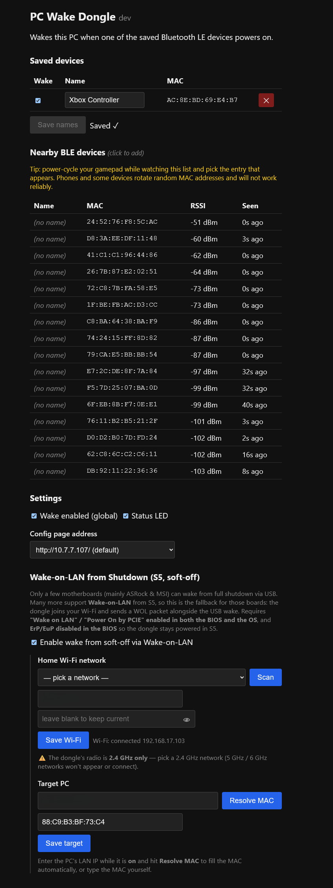

# User Guide: Wake-on-LAN fallback (S5 / soft-off)

This page covers the **Wake-on-LAN (WOL)** fallback in detail. For everything
else (flashing, the BLE device list, the basic config page), see the main
[README](README.md).

## Why this exists

Waking a PC from **S3 (sleep)** over USB-HID remote wakeup is a near-universal
feature — that's what the dongle does by default, with no setup. Waking from
**S5 (soft-off / fully shut down)** over USB-HID is not: it only works on a
handful of motherboards (mainly ASRock and MSI). **Wake-on-LAN from S5** is
supported much more broadly. So when "Enable WOL" is turned on, the dongle
*also* sends a WOL magic packet over its own Wi-Fi connection whenever it
would otherwise try to wake the PC — covering boards where the USB path
can't reach S5 at all.

The dongle can't reliably tell S3 apart from S5 over USB, so it always fires
both wake paths together. A stray WOL packet while the PC is merely asleep
in S3 is harmless.

## Requirements

Your PC must be wired to the same LAN by Ethernet, with NIC Wake-on-LAN
enabled in **both** BIOS and OS:

- **BIOS/UEFI**: enable "Wake on LAN" / "Power On by PCIE" (naming varies by
  vendor), and **disable ErP/EuP** ("deep power off") — ErP cuts power to
  the NIC in S5, which would otherwise also leave the dongle without a way
  to wake it. ErP/EuP often defaults to *enabled* and needs an explicit
  override.
- **OS** (Windows): Device Manager → your network adapter → Power Management
  tab → "Allow this device to wake the computer". Also check the adapter's
  Advanced settings for a "Wake on Magic Packet" option and enable it.
- The dongle itself must stay powered while the PC is off — this is normally
  automatic if it's plugged into a USB port that supplies standby power.

## Setup

Open the dongle's config page (default **http://10.7.7.107/**) and scroll to
**"Wake-on-LAN from Shutdown (S5, soft-off)"**.

1. Tick **"Enable wake-on-LAN"**.
2. Under **Home Wi-Fi network**, click **Scan** and pick your SSID from the
   dropdown (2.4 GHz only — the CYW43 radio doesn't support 5 GHz), or type
   the SSID manually if it doesn't show up. Enter the password and click
   **Save Wi-Fi**.
   - The status line below updates to `connecting…`, then
     `connected <ip>` once it's joined. If you see `auth failed`, re-check
     the password; `network not found` usually means the AP is out of range
     or is 5 GHz-only.
3. Under **Target PC**, enter the PC's **IP address** and click
   **Resolve MAC** — the dongle ARPs for it on your LAN and fills in the MAC
   address field. (This only works while the PC is awake, since a sleeping
   or shut-down PC won't answer ARP.) Click **Save target**.
4. Power off the PC fully (S5) and test by powering on the paired BLE device.

## Troubleshooting

- **Connects only on the second attempt after a fresh flash**: a known
  quirk of the Pico W/2W's cyw43 Wi-Fi firmware on first associate; it
  retries automatically and connects shortly after. Not a configuration
  issue.
- **WOL sent but PC doesn't wake**: double-check ErP/EuP is off and "Wake on
  Magic Packet" is enabled in the OS adapter settings — these are the two
  most commonly missed settings.
- **MAC won't resolve**: make sure the PC is awake and on the same subnet as
  the dongle's Wi-Fi connection when you click Resolve.
